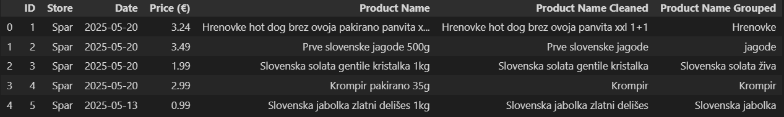
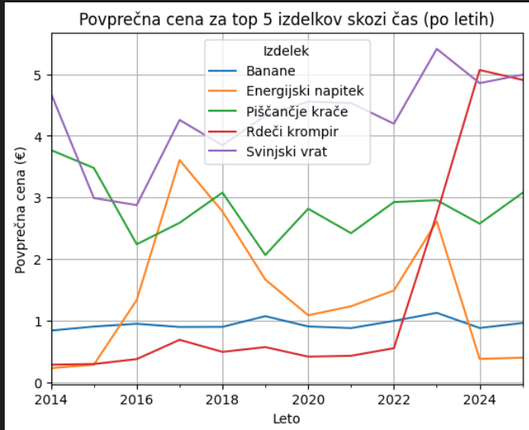
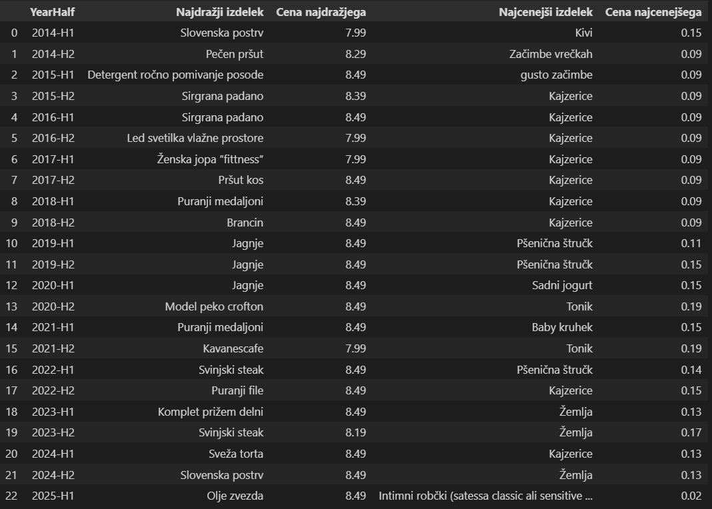
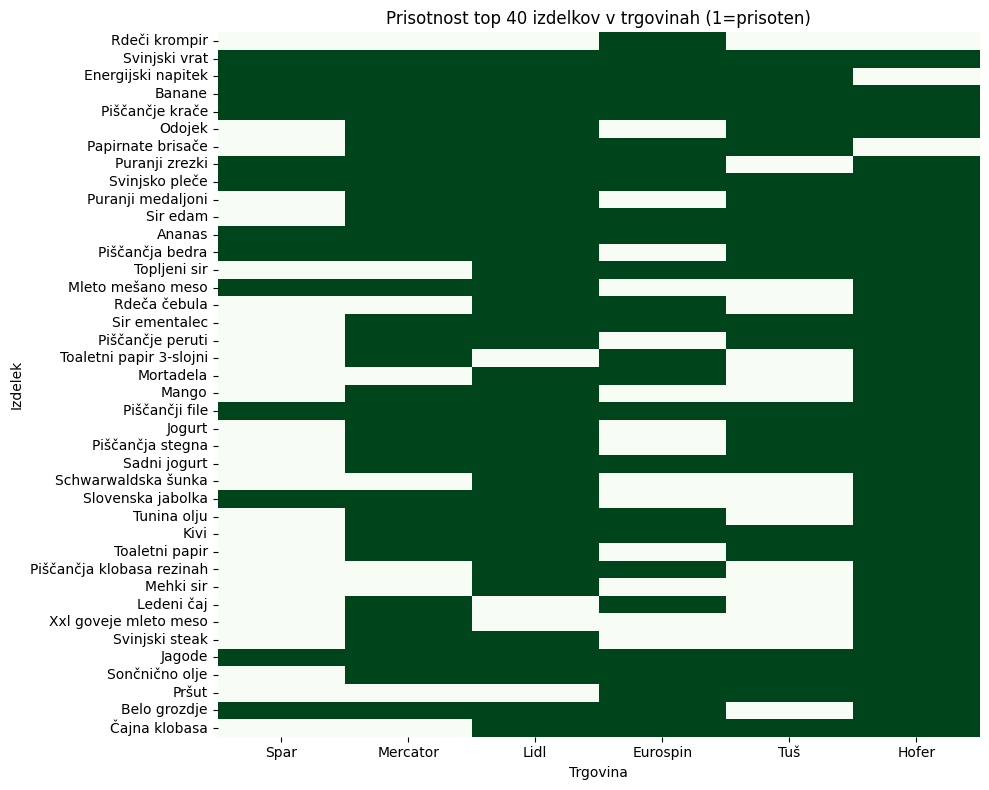
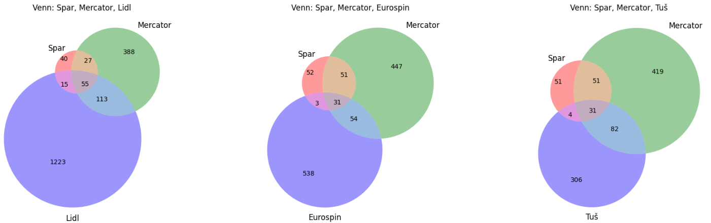
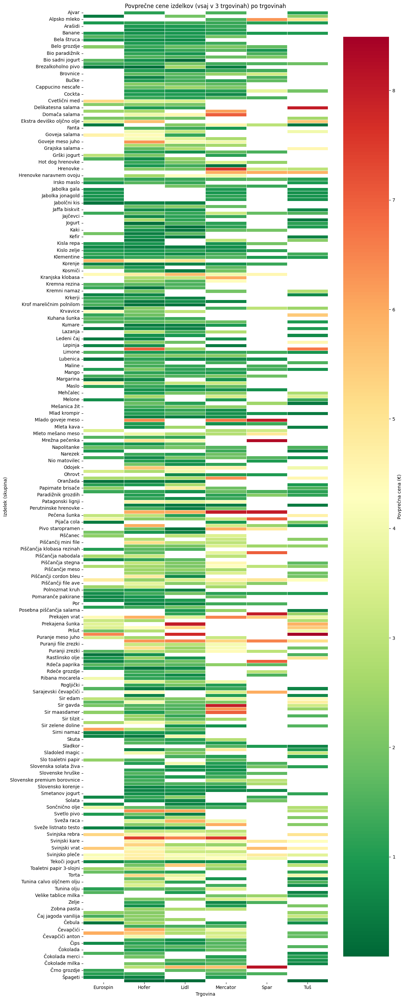

Problem:

V zadnjih dveh letih so mediji vedno več poročali o drastičnim naraščanjem cen živil, ki pa vpliva na življenjski standard prebivalcev. Inflacija živil je presegla splošno inflacijo in predstavlja enega ključnih izzivov za gospodinjstva. Ta teama se nam je klub težko dostopnim podatkom zdela zanimiva in izvedljiva.

Podatki:

Kot že zgoraj rečeno smo imeli kar veliko problemo z pridobivanjem podatkov, te pa smo na koncu pridobili z web scrapanjom glavnega opisa za vsak katalog na spletni strani https://vsikatalogi.si .

glavni te so:
- vse_cene:cleaned_top6_grouped, ki imajo vse izdelke pogruperane na posplošene skupine, za primer je priložena slika.

Za uravnovešenje cen skozi leta za promerjavo med trgovinami pa smo uporabili index spreminjanja cene glede na leto 2015 iz spletne strani https://pxweb.stat.si/SiStat/sl .

Za primerjanje z drugimi državami pa imamo EU-indexi, ki prav tako gleda procentualni odmik od leta 2015.

Analiza:
Aalizo smo spremenili na dva dela, in to sicer na del z izdelki in del z trgovinami.

DEL Z IZDELKI:

- Eden od zanimivih grafov je graf povprečne cene top 5 izdelkov,ki se najpogosteje pojavijo.

Iz tega grafa lahko raberemo da banane zelo lepo držijo ceno okoli 1 euro, ter pa veliko povečanje cene rdečega kromperja.

- Zanimivi pa so tudi podaki, najcenejšega in najdražjega izdelka v polletju.

Iz te slike pa je vidno vztrajanje cene kajzerice skozi kar 3leta in pol.

DEL Z TRGOVINAMI:

- ker smo imeli zelo omejeno količino podatkov smo najprej naredili prikaz vseh izdelkov, ki se pojavijo v večih trgovinah, tako da jih lahko med sabo primerjamo.

- tukaj pa imamo par venovih diagramov, ki kažejo vsebovanost izdelkov med različnimi trgovinami:

- Nam osebno najbol zanimiv del pa je heatmap cen izdelkov glede na trgovine:
