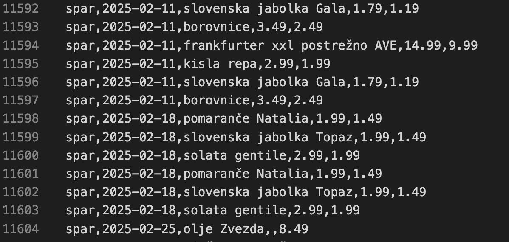
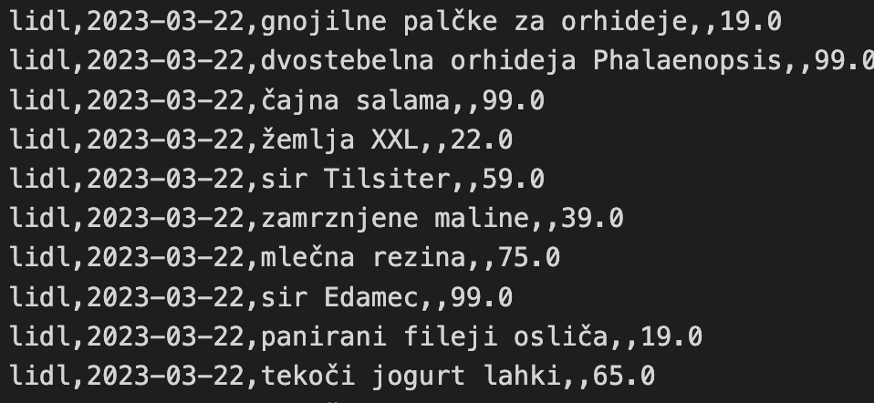

Pri projektu smo se odločili za pridobivanje podatkov iz spletne strani https://vsikatalogi.si, saj ponuja obsežno zbirko katalogov in informacij, ki so bile ključne za našo analizo. Med procesom pridobivanja in obdelave podatkov smo naleteli na več težav, ki so vplivale na učinkovitost in natančnost našega dela.

## Težave pri obdelavi podatkov:

1. Neenotna struktura podatkov: Podatki na spletni strani niso bili dosledno strukturirani, kar je otežilo avtomatizirano pridobivanje in obdelavo. Različni zapisi so uporabljali različne formate, kar je zahtevalo dodatno prilagoditev našega orodja za ekstrakcijo podatkov.

2. PDF vsebina: Velik deli spletne strani so bili kataloki, ki so imeli zelo neenakomerno porazdelitev izdelkov in cen. Kar je otežilo neposredno pridobivanje podatkov s standardnimi tehnikami, kot je uporaba knjižnic za spletno Skrejpanje.

Podatke smo nato obdelali z dvema različnima funkcijama,
1. Funkcija: (primer ene vrstice)

https://vsikatalogi.si/mercator-akcija/mercator-akcija-za-zacetek-tedna-do-22-03-2,"Mercator akcija Mercator akcija za svež začetek tedna velja od 20. 03. do 22. 03. 2017 v vseh trgovinah Mercator v Sloveniji.Od ponedeljka do srede vas v trgovinah Mercator čaka prihranek ob nakupu naslednjih izdelkov:– Pomaranče pakirane po 2 kg za 1, 49 €– Jabolka jonaprince 0, 85 €– Sveže zelje 0, 39 €– Telečje stegno 12, 99 €– Puranji file, zrezki 500 g za 3, 29 €– Leskovački čevapčiči Ave Grill pakirani po 480 g za 3, 39 € Za celotno ponudbo prelistajte aktualni katalog na povezaviMercator katalog, vse aktualne dnevne akcije za vas zbiramo v rubrikiDnevne akcije. Sliko Mercator akcije za svež začetek tedna si lahko pogledate pod besedilom.Mercator akcija Mercator akcija"

2. Funkcija: (primer večih vrstic)

## Problemi pri Funkcijah
Zgoraj navedena funkcija kaže lepo razporejene cene samo za datume, ki se pojavijo pred junijem 2023 se cene popačijo:

Domnevamo da gre za spremembo zapisa cene na spletni strani, na katero moramo še prirediti našo funkcijo.
## Zaključek

Kljub omenjenim težavam smo uspeli pridobiti nek osnovni nabor podatkov, ki je sicer bisveno manjši od pričakovanega. Zaradi tega razmišljamo tudi o primerjavi današnjih cen preko spletnih trgovin ponudnikov, saj smo ugotovili da podatkov ne moremo dobiti samo preko enega umesnika(ceneje.si), saj nimajo živilskih izdelkov.

